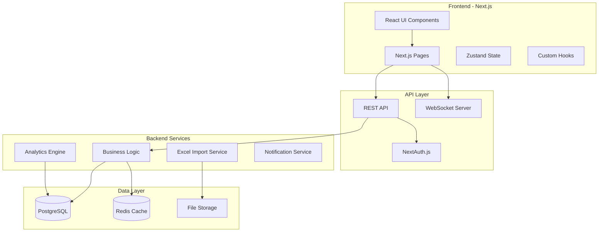

# System Architecture

## Overview
The Coaching Performance Management System is a web-based application designed to streamline coaching sessions and performance tracking in call center environments.

## Architecture Principles
- **Modular Design**: Separate concerns for maintainability
- **Type Safety**: Full TypeScript implementation
- **Real-time Updates**: WebSocket for live sessions
- **Offline Capable**: Progressive Web App features
- **API First**: RESTful design with clear contracts

## High-Level Architecture



## Component Architecture

### Frontend Structure
```
src/
├── components/
│   ├── common/           # Shared components
│   │   ├── Button.tsx
│   │   ├── Modal.tsx
│   │   └── DataTable.tsx
│   ├── dashboard/        # Dashboard components
│   │   ├── TeamLeaderDashboard.tsx
│   │   ├── PriorityQueue.tsx
│   │   └── QuickStats.tsx
│   ├── coaching/         # Coaching components
│   │   ├── PrepScreen.tsx
│   │   ├── LiveSession.tsx
│   │   └── ActionItems.tsx
│   └── notes/           # Quick notes
│       ├── QuickNoteButton.tsx
│       └── NotesList.tsx
├── pages/               # Next.js pages
│   ├── api/            # API routes
│   ├── dashboard.tsx
│   ├── coaching/
│   └── admin/
├── hooks/              # Custom React hooks
│   ├── useCoachingSession.ts
│   ├── useQuickNotes.ts
│   └── useMetrics.ts
├── lib/                # Utilities
│   ├── api-client.ts
│   ├── excel-processor.ts
│   └── analytics.ts
└── types/              # TypeScript definitions
    ├── models.ts
    ├── api.ts
    └── ui.ts
```

### Backend Structure
```
api/
├── routes/
│   ├── auth.routes.ts
│   ├── users.routes.ts
│   ├── coaching.routes.ts
│   ├── metrics.routes.ts
│   └── import.routes.ts
├── controllers/
│   ├── coaching.controller.ts
│   ├── metrics.controller.ts
│   └── import.controller.ts
├── services/
│   ├── coaching.service.ts
│   ├── analytics.service.ts
│   ├── notification.service.ts
│   └── excel.service.ts
├── middleware/
│   ├── auth.middleware.ts
│   ├── validation.middleware.ts
│   └── error.middleware.ts
└── utils/
    ├── database.ts
    ├── cache.ts
    └── logger.ts
```

## Data Flow Patterns

### 1. Excel Import Flow
```typescript
// AI Context: This is the data import pipeline
interface ImportFlow {
  steps: [
    "User uploads Excel file",
    "Frontend validates file format",
    "Upload to S3 with unique key",
    "API processes in background",
    "Validate data integrity",
    "Stage in temporary tables",
    "User reviews preview",
    "Commit or rollback"
  ];
}
```

### 2. Coaching Session Flow
```typescript
// AI Context: Real-time coaching session management
interface SessionFlow {
  preparation: {
    loadAgentData: "Fetch from PostgreSQL",
    generateAgenda: "AI service generates topics",
    compileNotes: "Aggregate unaddressed notes",
    cacheData: "Store in Redis for quick access"
  };
  
  liveSession: {
    initWebSocket: "Establish real-time connection",
    syncUpdates: "Auto-save every 30 seconds",
    trackMetrics: "Log engagement scores",
    manageActions: "Create and assign in real-time"
  };
  
  completion: {
    finalizeNotes: "Save to database",
    scheduleFollowUp: "Create calendar events",
    updateMetrics: "Recalculate agent scores",
    notifyAgent: "Send summary email"
  };
}
```

## Security Architecture

### Authentication & Authorization
```typescript
// AI Context: Role-based security implementation
interface SecurityModel {
  authentication: {
    provider: "NextAuth.js",
    strategies: ["credentials", "oauth"],
    sessionStorage: "JWT with secure cookies"
  };
  
  authorization: {
    model: "RBAC", // Role-Based Access Control
    roles: ["ADMIN", "MANAGER", "TEAM_LEADER", "AGENT"],
    permissions: {
      ADMIN: ["*"], // All permissions
      MANAGER: ["VIEW_ALL_TEAMS", "GENERATE_REPORTS"],
      TEAM_LEADER: ["MANAGE_AGENTS", "CREATE_SESSIONS"],
      AGENT: ["VIEW_OWN_DATA", "JOIN_SESSIONS"]
    }
  };
  
  dataProtection: {
    encryption: "AES-256 for sensitive data",
    pii: "Masked in logs and non-production",
    audit: "All actions logged with user context"
  };
}
```

## Performance Optimization

### Caching Strategy
```typescript
// AI Context: Multi-level caching approach
interface CachingStrategy {
  levels: {
    browser: {
      type: "Service Worker + IndexedDB",
      ttl: "5 minutes",
      data: ["UI assets", "recent metrics"]
    },
    
    cdn: {
      type: "CloudFlare",
      ttl: "1 hour",
      data: ["Static assets", "Excel templates"]
    },
    
    application: {
      type: "Redis",
      ttl: "15 minutes",
      data: ["Session data", "Dashboard metrics"]
    },
    
    database: {
      type: "PostgreSQL materialized views",
      ttl: "1 hour",
      data: ["Aggregated metrics", "Reports"]
    }
  };
}
```

### Database Optimization
- Indexed columns for common queries
- Partitioned tables for historical data
- Connection pooling with pgBouncer
- Read replicas for reporting

## Scalability Considerations

### Horizontal Scaling
```yaml
# AI Context: Kubernetes deployment config
apiVersion: apps/v1
kind: Deployment
metadata:
  name: coaching-app
spec:
  replicas: 3
  strategy:
    type: RollingUpdate
  template:
    spec:
      containers:
      - name: app
        resources:
          requests:
            memory: "512Mi"
            cpu: "250m"
          limits:
            memory: "1Gi"
            cpu: "500m"
```

### Load Balancing
- Application: NGINX reverse proxy
- Database: PgPool for connection distribution
- WebSocket: Sticky sessions for live coaching

## Monitoring & Observability

### Metrics Collection
```typescript
// AI Context: What we track for system health
interface Monitoring {
  infrastructure: {
    tool: "Prometheus + Grafana",
    metrics: ["CPU", "Memory", "Disk", "Network"]
  };
  
  application: {
    tool: "New Relic / DataDog",
    metrics: ["Response time", "Error rate", "Throughput"]
  };
  
  business: {
    tool: "Custom analytics",
    metrics: ["Coaching sessions", "User engagement", "Data imports"]
  };
  
  logging: {
    tool: "ELK Stack",
    levels: ["ERROR", "WARN", "INFO", "DEBUG"],
    retention: "30 days"
  };
}
```

## Error Handling Strategy

### Global Error Handler
```typescript
// AI Context: Centralized error management
class ErrorHandler {
  static handle(error: AppError): ErrorResponse {
    // Log to monitoring service
    logger.error(error);
    
    // Notify if critical
    if (error.severity === 'CRITICAL') {
      notificationService.alertOps(error);
    }
    
    // Return user-friendly message
    return {
      code: error.code,
      message: this.getUserMessage(error),
      timestamp: new Date().toISOString()
    };
  }
}
```

## Deployment Architecture

### Environments
- **Development**: Local Docker Compose
- **Staging**: Kubernetes cluster (scaled down)
- **Production**: Kubernetes cluster (full scale)

### CI/CD Pipeline
```yaml
# AI Context: GitHub Actions workflow
name: Deploy
on:
  push:
    branches: [main]
jobs:
  test:
    runs-on: ubuntu-latest
    steps:
      - uses: actions/checkout@v2
      - run: npm test
  
  build:
    needs: test
    steps:
      - run: docker build -t coaching-app:${{ github.sha }}
      - run: docker push
  
  deploy:
    needs: build
    steps:
      - run: kubectl apply -f k8s/
```

## Integration Points

### External Systems
```typescript
// AI Context: Third-party integrations
interface Integrations {
  current: {
    email: {
      service: "SendGrid",
      purpose: "Notifications and reports"
    },
    storage: {
      service: "AWS S3",
      purpose: "Excel files and exports"
    }
  };
  
  future: {
    telephony: {
      service: "Twilio/Five9",
      purpose: "Call recordings integration"
    },
    calendar: {
      service: "Google Calendar",
      purpose: "Session scheduling"
    },
    hr: {
      service: "Workday/BambooHR",
      purpose: "Employee data sync"
    }
  };
}
```

## Development Guidelines

### Code Organization
- **Single Responsibility**: Each module has one clear purpose
- **DRY Principle**: Reuse code through shared utilities
- **Type Safety**: No `any` types, full TypeScript coverage
- **Testing**: Minimum 80% code coverage

### AI-Assisted Development
When using AI tools like Copilot:
1. Reference this architecture for context
2. Follow established patterns
3. Maintain consistent naming
4. Update documentation with changes

---

**Note for AI Development**: This architecture document provides the high-level system design. Always cross-reference with DATABASE_SCHEMA.md for data structures and API_SPECIFICATION.md for endpoint details.