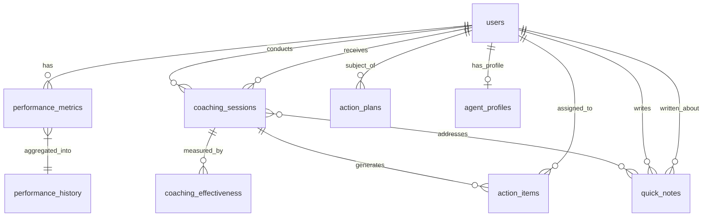

# Database Schema Documentation

## Overview
Complete PostgreSQL database schema for the Coaching Performance Management System. This document includes all tables, relationships, indexes, and data types with AI-friendly comments.

## Schema Conventions
- **Primary Keys**: UUID for all tables
- **Timestamps**: created_at, updated_at on all tables
- **Soft Deletes**: deleted_at where applicable
- **Naming**: snake_case for all identifiers
- **Indexes**: On all foreign keys and commonly queried fields

## Core Tables

### users
```sql
-- AI Context: Central user table for all system roles
CREATE TABLE users (
    id UUID PRIMARY KEY DEFAULT gen_random_uuid(),
    email VARCHAR(255) UNIQUE NOT NULL,
    password_hash VARCHAR(255) NOT NULL, -- bcrypt hashed
    name VARCHAR(255) NOT NULL,
    role ENUM('ADMIN','MANAGER','TEAM_LEADER','AGENT') NOT NULL,
    
    -- Organizational hierarchy
    team_leader_id UUID REFERENCES users(id), -- For agents
    manager_id UUID REFERENCES users(id),     -- For team leaders
    department VARCHAR(100),
    
    -- Profile information
    employee_id VARCHAR(50) UNIQUE,
    hire_date DATE,
    phone VARCHAR(20),
    avatar_url VARCHAR(500),
    
    -- Status and preferences
    status ENUM('ACTIVE','PIP','LEAVE','TERMINATED') DEFAULT 'ACTIVE',
    learning_style VARCHAR(50), -- Visual, Auditory, Kinesthetic
    shift_pattern VARCHAR(50),  -- Morning, Evening, Night, Rotating
    timezone VARCHAR(50) DEFAULT 'UTC',
    
    -- System fields
    last_login_at TIMESTAMP,
    password_reset_token VARCHAR(255),
    password_reset_expires TIMESTAMP,
    created_at TIMESTAMP DEFAULT NOW(),
    updated_at TIMESTAMP DEFAULT NOW(),
    deleted_at TIMESTAMP -- Soft delete
);

-- Indexes for performance
CREATE INDEX idx_users_email ON users(email);
CREATE INDEX idx_users_role ON users(role);
CREATE INDEX idx_users_team_leader ON users(team_leader_id);
CREATE INDEX idx_users_manager ON users(manager_id);
CREATE INDEX idx_users_status ON users(status) WHERE deleted_at IS NULL;
```

### performance_metrics
```sql
-- AI Context: Daily performance data for agents
CREATE TABLE performance_metrics (
    id UUID PRIMARY KEY DEFAULT gen_random_uuid(),
    agent_id UUID NOT NULL REFERENCES users(id),
    metric_date DATE NOT NULL,
    
    -- Core performance scores (0-100)
    service_score DECIMAL(5,2) CHECK (service_score >= 0 AND service_score <= 100),
    productivity_score DECIMAL(5,2) CHECK (productivity_score >= 0 AND productivity_score <= 100),
    quality_score DECIMAL(5,2) CHECK (quality_score >= 0 AND quality_score <= 100),
    attendance_rate DECIMAL(5,2) CHECK (attendance_rate >= 0 AND attendance_rate <= 100),
    adherence_score DECIMAL(5,2) CHECK (adherence_score >= 0 AND adherence_score <= 100),
    
    -- Detailed operational metrics
    csat DECIMAL(3,2), -- Customer Satisfaction (1-5 scale)
    fcr DECIMAL(5,2),  -- First Call Resolution percentage
    aht INTEGER,       -- Average Handle Time in seconds
    calls_handled INTEGER,
    calls_transferred INTEGER,
    calls_escalated INTEGER,
    
    -- Schedule adherence details
    scheduled_hours DECIMAL(4,2),
    actual_hours DECIMAL(4,2),
    break_time_minutes INTEGER,
    lunch_time_minutes INTEGER,
    aux_time_minutes INTEGER, -- Auxiliary time (training, meetings)
    
    -- Compliance metrics
    script_adherence DECIMAL(5,2),
    compliance_score DECIMAL(5,2),
    qa_score DECIMAL(5,2), -- Quality Assurance score
    
    -- Calculated composite score
    composite_score DECIMAL(5,2) GENERATED ALWAYS AS (
        (service_score * 0.25 + 
         productivity_score * 0.20 + 
         quality_score * 0.20 + 
         attendance_rate * 0.20 + 
         adherence_score * 0.15)
    ) STORED,
    
    -- Metadata
    imported_from VARCHAR(255), -- Source file name if imported
    created_at TIMESTAMP DEFAULT NOW(),
    updated_at TIMESTAMP DEFAULT NOW(),
    
    -- Prevent duplicate entries
    UNIQUE(agent_id, metric_date)
);

-- Performance indexes
CREATE INDEX idx_metrics_agent_date ON performance_metrics(agent_id, metric_date DESC);
CREATE INDEX idx_metrics_date ON performance_metrics(metric_date DESC);
CREATE INDEX idx_metrics_composite ON performance_metrics(composite_score);
```

### performance_history
```sql
-- AI Context: Weekly/Monthly aggregated performance for trend analysis
CREATE TABLE performance_history (
    id UUID PRIMARY KEY DEFAULT gen_random_uuid(),
    agent_id UUID NOT NULL REFERENCES users(id),
    period_type ENUM('WEEK','MONTH','QUARTER') NOT NULL,
    period_ending DATE NOT NULL,
    
    -- Aggregated metrics (averages for the period)
    avg_service_score DECIMAL(5,2),
    avg_productivity_score DECIMAL(5,2),
    avg_quality_score DECIMAL(5,2),
    avg_attendance_rate DECIMAL(5,2),
    avg_adherence_score DECIMAL(5,2),
    avg_composite_score DECIMAL(5,2),
    
    -- Trends (change from previous period)
    service_trend DECIMAL(5,2), -- Positive = improvement
    productivity_trend DECIMAL(5,2),
    quality_trend DECIMAL(5,2),
    attendance_trend DECIMAL(5,2),
    adherence_trend DECIMAL(5,2),
    
    -- Statistical measures
    score_variance DECIMAL(5,2), -- Consistency indicator
    days_worked INTEGER,
    
    -- Significant events during period
    annotations JSONB, -- {events: [{date, type, description}]}
    
    created_at TIMESTAMP DEFAULT NOW(),
    UNIQUE(agent_id, period_type, period_ending)
);

CREATE INDEX idx_history_agent_period ON performance_history(agent_id, period_ending DESC);
```

### coaching_sessions
```sql
-- AI Context: Coaching session management and history
CREATE TABLE coaching_sessions (
    id UUID PRIMARY KEY DEFAULT gen_random_uuid(),
    agent_id UUID NOT NULL REFERENCES users(id),
    team_leader_id UUID NOT NULL REFERENCES users(id),
    
    -- Scheduling
    scheduled_date TIMESTAMP NOT NULL,
    actual_start_time TIMESTAMP,
    actual_end_time TIMESTAMP,
    duration_minutes INTEGER GENERATED ALWAYS AS (
        EXTRACT(EPOCH FROM (actual_end_time - actual_start_time)) / 60
    ) STORED,
    
    -- Session type and status
    session_type ENUM('REGULAR','FOLLOW_UP','PIP_CHECK','URGENT') DEFAULT 'REGULAR',
    status ENUM('SCHEDULED','IN_PROGRESS','COMPLETED','CANCELLED','NO_SHOW') DEFAULT 'SCHEDULED',
    
    -- Preparation data (JSON for flexibility)
    prep_data JSONB, -- {agenda_items, metrics_snapshot, suggested_topics}
    
    -- Session content
    topics_covered TEXT[], -- Array of discussion topics
    discussion_notes TEXT,
    agent_commitments TEXT,
    resources_shared TEXT[], -- Links or document names
    
    -- Behavioral observations
    engagement_score INTEGER CHECK (engagement_score BETWEEN 1 AND 5),
    receptiveness_score INTEGER CHECK (receptiveness_score BETWEEN 1 AND 5),
    understanding_score INTEGER CHECK (understanding_score BETWEEN 1 AND 5),
    
    -- Outcomes
    overall_effectiveness INTEGER CHECK (overall_effectiveness BETWEEN 1 AND 5),
    key_achievements TEXT,
    areas_of_concern TEXT,
    
    -- Follow-up
    follow_up_required BOOLEAN DEFAULT FALSE,
    follow_up_date DATE,
    follow_up_topics TEXT[],
    
    -- Metadata
    cancelled_reason TEXT,
    no_show_reason TEXT,
    created_at TIMESTAMP DEFAULT NOW(),
    updated_at TIMESTAMP DEFAULT NOW()
);

-- Indexes for common queries
CREATE INDEX idx_sessions_agent ON coaching_sessions(agent_id, scheduled_date DESC);
CREATE INDEX idx_sessions_leader ON coaching_sessions(team_leader_id, scheduled_date DESC);
CREATE INDEX idx_sessions_status ON coaching_sessions(status);
CREATE INDEX idx_sessions_date ON coaching_sessions(scheduled_date);
```

### quick_notes
```sql
-- AI Context: Real-time observations by team leaders
CREATE TABLE quick_notes (
    id UUID PRIMARY KEY DEFAULT gen_random_uuid(),
    team_leader_id UUID NOT NULL REFERENCES users(id),
    agent_id UUID NOT NULL REFERENCES users(id),
    
    -- Note categorization
    note_type ENUM('POSITIVE','COACHING','URGENT','COMPLIANCE','GENERAL') NOT NULL,
    category VARCHAR(100), -- Call Quality, Customer Service, etc.
    subcategory VARCHAR(100), -- More specific classification
    
    -- Content
    content TEXT NOT NULL,
    
    -- Context (optional)
    call_id VARCHAR(100), -- If related to specific call
    customer_id VARCHAR(100), -- If related to specific customer
    timestamp_occurred TIMESTAMP DEFAULT NOW(), -- When the observed behavior happened
    
    -- Priority and handling
    priority ENUM('HIGH','MEDIUM','LOW') DEFAULT 'MEDIUM',
    requires_follow_up BOOLEAN DEFAULT FALSE,
    
    -- Linking to coaching
    linked_session_id UUID REFERENCES coaching_sessions(id),
    addressed BOOLEAN DEFAULT FALSE,
    addressed_date TIMESTAMP,
    addressed_notes TEXT,
    
    -- Metadata
    created_at TIMESTAMP DEFAULT NOW(),
    updated_at TIMESTAMP DEFAULT NOW()
);

-- Indexes for quick access
CREATE INDEX idx_notes_agent_unaddressed ON quick_notes(agent_id, addressed) 
    WHERE addressed = FALSE;
CREATE INDEX idx_notes_leader ON quick_notes(team_leader_id, created_at DESC);
CREATE INDEX idx_notes_priority ON quick_notes(priority, created_at DESC) 
    WHERE addressed = FALSE;
```

### action_items
```sql
-- AI Context: Trackable tasks from coaching sessions
CREATE TABLE action_items (
    id UUID PRIMARY KEY DEFAULT gen_random_uuid(),
    session_id UUID REFERENCES coaching_sessions(id),
    agent_id UUID NOT NULL REFERENCES users(id),
    assigned_by UUID NOT NULL REFERENCES users(id),
    
    -- Task details
    title VARCHAR(255) NOT NULL,
    description TEXT NOT NULL,
    category VARCHAR(100), -- Training, Practice, Behavioral, etc.
    
    -- Timing
    due_date DATE NOT NULL,
    reminder_date DATE,
    completed_date TIMESTAMP,
    
    -- Priority and status
    priority ENUM('HIGH','MEDIUM','LOW') DEFAULT 'MEDIUM',
    status ENUM('PENDING','IN_PROGRESS','COMPLETED','OVERDUE','CANCELLED') DEFAULT 'PENDING',
    
    -- Progress tracking
    progress_percentage INTEGER DEFAULT 0 CHECK (progress_percentage >= 0 AND progress_percentage <= 100),
    progress_notes TEXT,
    blockers TEXT,
    
    -- Completion details
    completion_notes TEXT,
    verified_by UUID REFERENCES users(id),
    verification_date TIMESTAMP,
    
    -- Metadata
    created_at TIMESTAMP DEFAULT NOW(),
    updated_at TIMESTAMP DEFAULT NOW()
);

-- Indexes for task management
CREATE INDEX idx_actions_agent_status ON action_items(agent_id, status, due_date);
CREATE INDEX idx_actions_session ON action_items(session_id);
CREATE INDEX idx_actions_due ON action_items(due_date) WHERE status IN ('PENDING', 'IN_PROGRESS');
```

### action_plans
```sql
-- AI Context: Performance Improvement Plans (PIPs)
CREATE TABLE action_plans (
    id UUID PRIMARY KEY DEFAULT gen_random_uuid(),
    agent_id UUID NOT NULL REFERENCES users(id),
    created_by UUID NOT NULL REFERENCES users(id),
    approved_by UUID REFERENCES users(id),
    
    -- Plan timeline
    start_date DATE NOT NULL,
    target_end_date DATE NOT NULL,
    actual_end_date DATE,
    extension_count INTEGER DEFAULT 0,
    
    -- Status tracking
    status ENUM('DRAFT','ACTIVE','COMPLETED','EXTENDED','FAILED','CANCELLED') DEFAULT 'DRAFT',
    
    -- Plan details
    reason_for_plan TEXT NOT NULL,
    
    -- Target metrics (JSON for flexibility)
    target_metrics JSONB NOT NULL, 
    /* Example structure:
    {
        "service_score": {"target": 85, "current": 72},
        "quality_score": {"target": 90, "current": 78},
        "attendance_rate": {"target": 95, "current": 88}
    }
    */
    
    -- Success criteria
    success_criteria JSONB NOT NULL,
    /* Example structure:
    {
        "mandatory": ["service_score >= 85", "no_absences"],
        "recommended": ["complete_training", "positive_feedback"]
    }
    */
    
    -- Check-in schedule
    check_in_frequency ENUM('DAILY','TWICE_WEEKLY','WEEKLY','BIWEEKLY') DEFAULT 'WEEKLY',
    next_check_in_date DATE,
    
    -- Progress tracking
    progress_updates JSONB, -- Array of updates with dates and metrics
    current_score DECIMAL(5,2), -- Overall progress percentage
    
    -- Outcome
    outcome ENUM('SUCCESS','FAILURE','EXTENDED','RESIGNED') ,
    outcome_notes TEXT,
    lessons_learned TEXT,
    
    -- Metadata
    created_at TIMESTAMP DEFAULT NOW(),
    updated_at TIMESTAMP DEFAULT NOW()
);

-- Indexes for PIP management
CREATE INDEX idx_plans_agent_active ON action_plans(agent_id) WHERE status = 'ACTIVE';
CREATE INDEX idx_plans_check_in ON action_plans(next_check_in_date) WHERE status = 'ACTIVE';
```

### coaching_effectiveness
```sql
-- AI Context: Track what coaching methods work best
CREATE TABLE coaching_effectiveness (
    id UUID PRIMARY KEY DEFAULT gen_random_uuid(),
    session_id UUID REFERENCES coaching_sessions(id),
    agent_id UUID NOT NULL REFERENCES users(id),
    team_leader_id UUID NOT NULL REFERENCES users(id),
    
    -- Issue addressed
    primary_issue VARCHAR(255), -- AHT, Quality, Attendance, etc.
    intervention_method VARCHAR(255), -- Role-play, Shadowing, Training, etc.
    
    -- Metrics before and after
    metrics_before JSONB, -- Snapshot of relevant metrics
    metrics_after JSONB,  -- Metrics after intervention period
    measurement_period_days INTEGER DEFAULT 14,
    
    -- Improvement analysis
    improvement_percentage DECIMAL(5,2),
    sustained_after_30_days BOOLEAN,
    sustained_after_90_days BOOLEAN,
    
    -- Success factors
    success_factors TEXT[], -- What contributed to success
    failure_factors TEXT[], -- What hindered progress
    
    -- Recommendations
    recommended_for_similar_issues BOOLEAN DEFAULT FALSE,
    notes TEXT,
    
    created_at TIMESTAMP DEFAULT NOW()
);

CREATE INDEX idx_effectiveness_agent ON coaching_effectiveness(agent_id);
CREATE INDEX idx_effectiveness_method ON coaching_effectiveness(intervention_method);
```

### agent_profiles
```sql
-- AI Context: Behavioral and learning profiles for personalized coaching
CREATE TABLE agent_profiles (
    agent_id UUID PRIMARY KEY REFERENCES users(id),
    
    -- Learning preferences
    learning_style ENUM('VISUAL','AUDITORY','KINESTHETIC','READING') NOT NULL,
    preferred_feedback_method VARCHAR(100), -- Written, Verbal, Demonstration
    
    -- Motivational factors
    primary_motivators TEXT[], -- Recognition, Growth, Competition, Stability
    demotivators TEXT[], -- Public criticism, Micromanagement, etc.
    
    -- Strengths and development areas
    core_strengths TEXT[],
    development_areas TEXT[],
    hidden_talents TEXT[], -- Discovered through coaching
    
    -- Behavioral patterns
    stress_indicators TEXT[], -- Signs agent is struggling
    success_patterns TEXT[], -- Conditions when agent excels
    
    -- Coaching preferences
    best_coaching_time VARCHAR(50), -- Morning, Afternoon, End of shift
    preferred_session_length INTEGER, -- In minutes
    responds_well_to TEXT[], -- Encouragement, Direct feedback, Examples
    
    -- Historical insights
    career_aspirations TEXT,
    personal_goals TEXT,
    
    -- Peer comparisons (anonymous)
    peer_comparison_opt_in BOOLEAN DEFAULT TRUE,
    percentile_ranking JSONB, -- {service: 75, quality: 82, etc.}
    
    -- Metadata
    profile_created_by UUID REFERENCES users(id),
    last_updated_by UUID REFERENCES users(id),
    created_at TIMESTAMP DEFAULT NOW(),
    updated_at TIMESTAMP DEFAULT NOW()
);
```

### import_logs
```sql
-- AI Context: Track all data imports for audit and rollback
CREATE TABLE import_logs (
    id UUID PRIMARY KEY DEFAULT gen_random_uuid(),
    
    -- File information
    file_name VARCHAR(255) NOT NULL,
    file_size_bytes BIGINT,
    file_hash VARCHAR(64), -- SHA-256 for deduplication
    
    -- Import details
    import_type ENUM('METRICS','USERS','COACHING_HISTORY','PROFILES') NOT NULL,
    imported_by UUID NOT NULL REFERENCES users(id),
    
    -- Processing stats
    total_rows INTEGER,
    processed_rows INTEGER,
    successful_rows INTEGER,
    failed_rows INTEGER,
    skipped_rows INTEGER, -- Duplicates or unchanged
    
    -- Status and timing
    status ENUM('VALIDATING','PROCESSING','SUCCESS','PARTIAL_SUCCESS','FAILED','ROLLED_BACK') NOT NULL,
    started_at TIMESTAMP DEFAULT NOW(),
    completed_at TIMESTAMP,
    processing_time_seconds INTEGER GENERATED ALWAYS AS (
        EXTRACT(EPOCH FROM (completed_at - started_at))
    ) STORED,
    
    -- Error handling
    error_summary TEXT,
    error_details JSONB, -- [{row: 5, error: "Invalid date format"}]
    
    -- Rollback capability
    rollback_available BOOLEAN DEFAULT TRUE,
    rollback_executed_at TIMESTAMP,
    rollback_executed_by UUID REFERENCES users(id),
    
    -- Storage
    file_storage_path VARCHAR(500), -- S3 path or local path
    
    created_at TIMESTAMP DEFAULT NOW()
);

CREATE INDEX idx_imports_status ON import_logs(status, created_at DESC);
CREATE INDEX idx_imports_user ON import_logs(imported_by, created_at DESC);
```

## Relationships Summary



## Database Functions & Triggers

### Auto-update timestamps
```sql
-- AI Context: Automatic timestamp management
CREATE OR REPLACE FUNCTION update_updated_at_column()
RETURNS TRIGGER AS $$
BEGIN
    NEW.updated_at = NOW();
    RETURN NEW;
END;
$$ language 'plpgsql';

-- Apply to all tables with updated_at
CREATE TRIGGER update_users_updated_at BEFORE UPDATE ON users
    FOR EACH ROW EXECUTE FUNCTION update_updated_at_column();
-- Repeat for all tables...
```

### Calculate overdue status
```sql
-- AI Context: Automatic status updates for action items
CREATE OR REPLACE FUNCTION update_action_item_status()
RETURNS TRIGGER AS $$
BEGIN
    IF NEW.status IN ('PENDING', 'IN_PROGRESS') 
       AND NEW.due_date < CURRENT_DATE 
       AND NEW.completed_date IS NULL THEN
        NEW.status = 'OVERDUE';
    END IF;
    RETURN NEW;
END;
$$ language 'plpgsql';

CREATE TRIGGER check_action_overdue 
    BEFORE INSERT OR UPDATE ON action_items
    FOR EACH ROW EXECUTE FUNCTION update_action_item_status();
```

## Materialized Views

### team_performance_summary
```sql
-- AI Context: Pre-aggregated team metrics for dashboards
CREATE MATERIALIZED VIEW team_performance_summary AS
SELECT 
    tl.id as team_leader_id,
    tl.name as team_leader_name,
    COUNT(DISTINCT a.id) as agent_count,
    COUNT(DISTINCT ap.id) FILTER (WHERE ap.status = 'ACTIVE') as active_pips,
    AVG(pm.composite_score) as avg_team_score,
    AVG(pm.service_score) as avg_service_score,
    AVG(pm.quality_score) as avg_quality_score,
    COUNT(DISTINCT cs.id) FILTER (
        WHERE cs.scheduled_date >= CURRENT_DATE - INTERVAL '7 days'
    ) as sessions_last_week,
    DATE(NOW()) as calculated_date
FROM users tl
LEFT JOIN users a ON a.team_leader_id = tl.id AND a.role = 'AGENT'
LEFT JOIN performance_metrics pm ON pm.agent_id = a.id 
    AND pm.metric_date = CURRENT_DATE - 1
LEFT JOIN action_plans ap ON ap.agent_id = a.id
LEFT JOIN coaching_sessions cs ON cs.team_leader_id = tl.id
WHERE tl.role = 'TEAM_LEADER'
GROUP BY tl.id, tl.name;

-- Refresh daily
CREATE INDEX idx_team_summary_leader ON team_performance_summary(team_leader_id);
```

## Data Retention Policy

```sql
-- AI Context: Automated data archival
-- Keep detailed data for 13 months, aggregated data for 3 years

-- Archive old performance metrics
CREATE TABLE performance_metrics_archive (
    LIKE performance_metrics INCLUDING ALL
);

-- Monthly archival job
CREATE OR REPLACE FUNCTION archive_old_metrics()
RETURNS void AS $$
BEGIN
    INSERT INTO performance_metrics_archive
    SELECT * FROM performance_metrics
    WHERE metric_date < CURRENT_DATE - INTERVAL '13 months';
    
    DELETE FROM performance_metrics
    WHERE metric_date < CURRENT_DATE - INTERVAL '13 months';
END;
$$ LANGUAGE plpgsql;
```

## Performance Optimization Notes

1. **Partitioning**: Consider partitioning `performance_metrics` by month for large datasets
2. **Indexes**: All foreign keys and commonly filtered columns are indexed
3. **JSONB**: Used for flexible data that may evolve (prep_data, annotations)
4. **Generated Columns**: Used for calculated fields to avoid runtime computation
5. **Materialized Views**: For expensive aggregations refreshed on schedule

---

**AI Development Note**: This schema is optimized for PostgreSQL 14+. When generating queries, leverage JSONB operators, CTEs, and window functions for complex analytics. Always include proper indexes in migrations.